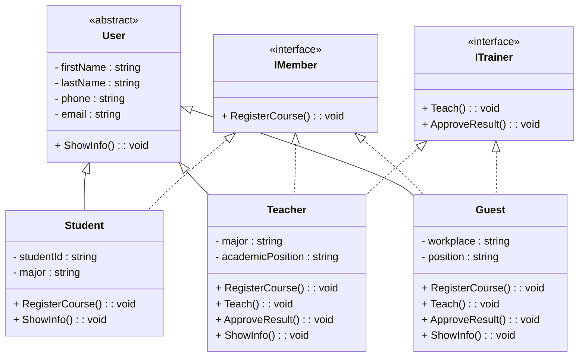

# Training System

## Class Diagram

```mermaid
classDiagram

class User {
    <<abstract>>
    - firstName : string
    - lastName : string
    - phone : string
    - email : string
    + ShowInfo() : void
}

class IMember {
    <<interface>>
    + RegisterCourse() : void
}

class ITrainer {
    <<interface>>
    + Teach() : void
    + ApproveResult() : void
}

class Student {
    - studentId : string
    - major : string
    + RegisterCourse() : void
    + ShowInfo() : void
}

class Teacher {
    - major : string
    - academicPosition : string
    + RegisterCourse() : void
    + Teach() : void
    + ApproveResult() : void
    + ShowInfo() : void
}

class Guest {
    - workplace : string
    - position : string
    + RegisterCourse() : void
    + Teach() : void
    + ApproveResult() : void
    + ShowInfo() : void
}

User <|-- Student
User <|-- Teacher
User <|-- Guest

IMember <|.. Student
IMember <|.. Teacher
IMember <|.. Guest

ITrainer <|.. Teacher
ITrainer <|.. Guest
```
